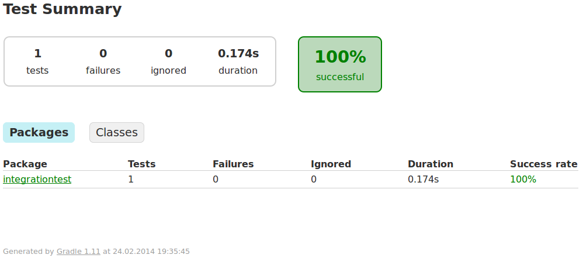

# integrationTest

Gretty example of web-application integration test.

This program features:

1. Simple servlet showing html page with div containing text 'Hello, integration test!'
2. Integration test based on [geb](http://www.gebish.org/) and [spock](http://code.google.com/p/spock/).
3. Gretty configuration to start/stop jetty on integration test.

This program requires Firefox to be installed on your machine.
If you use different browser, please change selenium driver in "build.gradle" accordingly.

## Usage

Run from command-line:

```
gradle integrationTest
```

Expected console output:

```shell
:integrationTest:compileJava UP-TO-DATE
:integrationTest:compileGroovy UP-TO-DATE
:integrationTest:processResources UP-TO-DATE
:integrationTest:classes UP-TO-DATE
:integrationTest:prepareInplaceWebAppFolder UP-TO-DATE
:integrationTest:compileTestJava UP-TO-DATE
:integrationTest:compileTestGroovy
:integrationTest:processTestResources UP-TO-DATE
:integrationTest:testClasses
:integrationTest:jettyBeforeIntegrationTest
Auto-configuring logback
scanInterval not specified (or zero), scanning disabled
Auto-configuring server connectors
Auto-configuring login service
2014-02-24 16:49:53.561 INFO  - jetty-9.1.0.v20131115
2014-02-24 16:49:53.986 INFO  - Started o.e.j.w.WebAppContext@45b47a71{/integrationTest,file:/home/ahi/dev/work/gretty/examples/integrationTest/build/inplaceWebapp/,AVAILABLE}
2014-02-24 16:49:53.996 INFO  - Started ServerConnector@380bf630{HTTP/1.1}{0.0.0.0:8080}
:integrationTest:test
:integrationTest:integrationTest
:integrationTest:jettyAfterIntegrationTest
2014-02-24 16:50:02.294 INFO  - Stopped ServerConnector@380bf630{HTTP/1.1}{0.0.0.0:8080}
2014-02-24 16:50:02.300 INFO  - Stopped o.e.j.w.WebAppContext@45b47a71{/integrationTest,file:/home/ahi/dev/work/gretty/examples/integrationTest/build/inplaceWebapp/,UNAVAILABLE}

BUILD SUCCESSFUL

Total time: 16.944 secs
```

You can inspect spock/geb output in "build/reports/tests/index.html" upon build completion:




